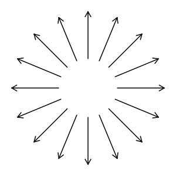
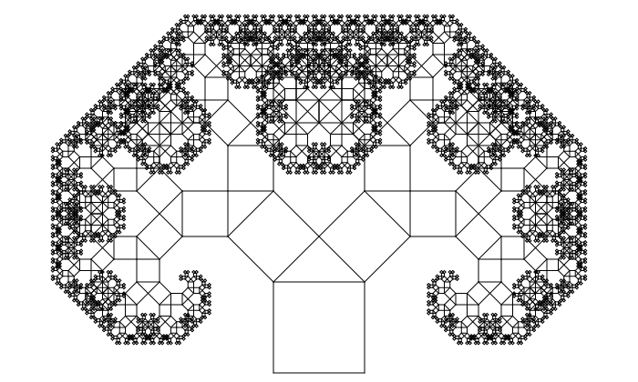

# `Space Objects` - библиотека для работы с объектами, представляющими собой пространства или подпространства.

В этой библиотеке представлены такие объекты, как: вектора, линии, плоскости, 2-х и 3-х мерные пространства. Пространства ненулевой размерности (всё, кроме векторов) имеют координаты на этом пространстве и обладают методами для преобразования координат из абсолютных в относительные конкретного пространства.

Так же имеются методы для нахождения пересечений прямых с прямыми, прямых с плоскостями, и плоскостей с плоскостями. Например, при нахождении пересечения плоскости с плоскостью, на выход можно получить две двухмерные прямые, одна из котороых лежит на линии пересечения в первой плоскости, а вторая на линии пересечения во второй плоскости. Либо же можно получить одну трехмерную прямую.

# Обзор библиотеки

Всё находится в пространстве имен `spob::` (сокращённо от SPace OBjects).

Для работы всей библиотеки достаточно подключить `<spob/spob.h>`.

## Краткий обзор классов:

* `vec2` - двумерный вектор.
* `vec3` - трехмерный вектор.
* `crd2` - двумерный базис координат, базовый класс для следующих двух объектов.
* `space2` - двумерное пространство.
* `line2` - прямая, одномерное подпространство.
* `crd3` - трехмерный базис коордита, базовый класс для следующих трех объектов.
* `space3` - трехмерное пространство.
* `plane3` - плоскость, двумерное подпространство.
* `line3` - прямая - одномерное подпространство.

## Методы этих классов:

* `.to()` - преобразование вектора положения из абсолютных координат к координатам объекта, от которого этот метод вызывается.
* `.toDir()` - тоже самое, но преобразуется вектор направления, то есть положение координат никак не влияет на это преобразование.
* `.from()` - преобразование вектора положение из координат текущего объекта к абсолютным координатам.
* `.fromDir()` - аналогично toDir(), но только с from().

## Основные функции для этих классов:

* `distance(a, b)` - расстояние между объектами a и b, оно рассчитывает расстояние между: векторами, прямыми, плоскостями, прямыми с плоскостями, векторами с прямыми и т. д. Так же корректно считает расстояние между трехмерными прямыми, когда они скрещиваются и во всех остальных случаях.
* `rotate()` - вращает некоторый объект относительно точки (в двумерном случае), относительно прямой (в трехмерном случае). 
* `intersect(a, b)` - находит пересечение двух объектов.

## Методы для проверки в этих классах:

* `.isRight()` - является ли данная система координат правой.
* `.isOrthogonal()` - является ли данная система координат ортогональной.
* `.isOrthonormal()` - является ли данная система координат ортонормированной.

## Основные функции проверки для объектов этих классов:

* `isPerpendicular(a, b)` - перпендикулярны ли a и b.
* `isIntersect(a, b)` - пересекаются ли a и b.
* `isContain(a, b)` - содержит ли объект a в себе объект b.
* `isParallel(a, b)` - параллельны ли a и b.
* `isSkew(a, b)` - скрещиваются ли прямые a и b.

## А что с остальным?

Вполне можно догадаться о предназначении методов по их названию и коду. Пока не буду описывать принцип их работы, тонкости и подводные камни. Оставлю это на завтрашнего себя и волю судьбы.

# Использование

## Рисуем стрелки
```c++
#include <cmath>
#include <spob/spobe.h>

using namespace spob;
void draw_line(vec2 a, vec2 b); // Некая сторонняя функция, которая рисует линию из точки a в точку b

void draw_arrow(vec2 a, vec2 b, double angle, double size) { // Стрелка начинается в точке a и кончается в точке b, стрелка должна находиться в точке b
	draw_line(a, b);

	// Создаем систему координат, которая начинается в точке b, и её вектор i направлен к точке a
	line2 line = makeLine2(b, a);

	// Нормализуем эту систему координат, потому что вектор i равен длине вектора (b-a)
	line.normalize();

	// Создаем две точки краев стрелки
	vec2 first(size, 0);
	vec2 second(size, 0);

	// Один край вращаем по часовой стрелке, а другой против
	first = rotate(first, vec2(0), angle);
	second = rotate(second, vec2(0), -angle);

	// Преобразуем эти края из системы координат линии в абсолютные координаты и рисуем это
	space2 space_of_line(line);
	draw_line(b, space_of_line.from(first));
	draw_line(b, space_of_line.from(second));
}

int main() {
	vec2 center(150, 150);

	vec2 a(50, 0); a += center;
	vec2 b(130, 0); b += center;

	// Рисование стрелок по всем направлениям
	int count = 4 + 3 * 4;
	for (int i = 0; i < count; ++i) {
		double angle = i * 2.0 * M_PI / double(count);
		draw_arrow(rotate(a, center, angle), rotate(b, center, angle), 30.0 / 180.0 * M_PI, 10);
	}
}
```

Полный код программы находится по адресу: `doc/arrow.cpp`.

Результат: 



## Рисуем дерево Пифагора

```c++
#include <cmath>
#include <spob/spob.h>

using namespace spob;
void draw_line(vec2 a, vec2 b); // Некая сторонняя функция, которая рисует линию из точки a в точку b

void draw_pythagoras_tree(const space2& space) {
	// Выходим из рекурсии, если одна из осей имеет длину меньше, чем 2. Это означает, что сейчас будет рисоваться квадрат с длиной стороны меньше, чем 2.
	if (space.i.length() < 2)
		return;

	vec2 a(0, 0);
	vec2 b(0, 1);
	vec2 c(1, 1);
	vec2 d(1, 0);

	// Рисуем квадрат
	draw_line(space.from(a), space.from(b));
	draw_line(space.from(b), space.from(c));
	draw_line(space.from(c), space.from(d));
	draw_line(space.from(d), space.from(a));

	// Находим вершину треугольника на верхней части квадрата
	vec2 triangle_vertex = rotate(b + vec2(sqrt(2.0)/2.0, 0), b, 45.0 / 180.0 * M_PI);

	// Рекурсивно рисуем дерево для каждой стороны этого треугольника на дереве пифагора
	draw_pythagoras_tree(makeLine2(space.from(b), space.from(triangle_vertex)));
	draw_pythagoras_tree(makeLine2(space.from(triangle_vertex), space.from(c)));
}

int main() {
	draw_pythagoras_tree(makeLine2(vec2(400, 410), vec2(300, 410)));
}
```

Полный код программы находится по адресу: `doc/pythagoras_tree.cpp`.

Результат: 

