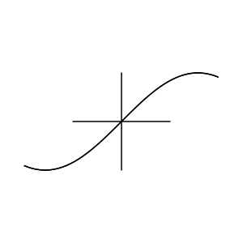

# `Space Objects` - библиотека для работы с объектами, представляющими собой пространства или подпространства.


В этой библиотеке представлены такие объекты, как: вектора, линии, плоскости, 2-х и 3-х мерные пространства. Пространства ненулевой размерности (всё, кроме векторов) имеют координаты на этом пространстве и обладают методами для преобразования координат из абсолютных в относительные конкретного пространства.

Так же имеются методы для нахождения пересечений прямых с прямыми, прямых с плоскостями, и плоскостей с плоскостями. Например, при нахождении пересечения плоскости с плоскостью, на выход можно получить две двухмерные прямые, одна из котороых лежит на линии пересечения в первой плоскости, а вторая на линии пересечения во второй плоскости. Либо же можно получить одну трехмерную прямую.

# Обзор библиотеки

Всё находится в пространстве имен `spob::` (сокращённо от SPace OBjects).

Для работы всей библиотеки достаточно подключить `<spob/spob.h>`.

## Краткий обзор классов:

* `vec2` - двумерный вектор.
* `vec3` - трехмерный вектор.
* `crd2` - двумерный базис координат, базовый класс для следующих двух объектов.
* `space2` - двумерное пространство.
* `line2` - прямая, одномерное подпространство `space2`.
* `crd3` - трехмерный базис координат, базовый класс для следующих трех объектов.
* `space3` - трехмерное пространство.
* `plane3` - плоскость, двумерное подпространство `space3`.
* `line3` - прямая, одномерное подпространство `space3`.

## Методы этих классов:

* `.to()` - преобразование вектора положения из абсолютных координат к координатам объекта, от которого этот метод вызывается.
* `.toDir()` - тоже самое, но преобразуется вектор направления, то есть положение координат никак не влияет на это преобразование.
* `.from()` - преобразование вектора положение из координат текущего объекта к абсолютным координатам.
* `.fromDir()` - аналогично toDir(), но только с from().

## Основные функции для этих классов:

* `distance(a, b)` - расстояние между объектами a и b, оно рассчитывает расстояние между: векторами, прямыми, плоскостями, прямыми с плоскостями, векторами с прямыми и т. д. Так же корректно считает расстояние между трехмерными прямыми, когда они скрещиваются и во всех остальных случаях.
* `rotate()` - вращает некоторый объект относительно точки (в двумерном случае), относительно прямой (в трехмерном случае). 
* `intersect(a, b)` - находит пересечение двух объектов.

## Методы для проверки в этих классах:

* `.isRight()` - является ли данная система координат правой.
* `.isOrthogonal()` - является ли данная система координат ортогональной.
* `.isOrthonormal()` - является ли данная система координат ортонормированной.

## Основные функции проверки для объектов этих классов:

* `isPerpendicular(a, b)` - перпендикулярны ли a и b.
* `isIntersect(a, b)` - пересекаются ли a и b.
* `isContain(a, b)` - содержит ли объект a в себе объект b.
* `isParallel(a, b)` - параллельны ли a и b.
* `isSkew(a, b)` - скрещиваются ли прямые a и b.

## А что с остальным?

Вполне можно догадаться о предназначении методов по их названию и коду. Пока не буду описывать принцип их работы, тонкости и подводные камни. Оставлю это на завтрашнего себя и волю судьбы.

# Использование

## Используем преобразование координат для рисования графика синуса

```c++
#include <cmath>
#include <spob/spob.h>

using namespace spob;
void draw_line(vec2 a, vec2 b); // Некая сторонняя функция, которая рисует линию из точки a в точку b

void draw_sin(const space2& tr) {
	// Рисуем оси координат
	draw_line(tr.from(vec2(-1, 0)), tr.from(vec2(1, 0)));
	draw_line(tr.from(vec2(0, -1)), tr.from(vec2(0, 1)));

	// Рисуем график функции sin(x) в пределах [-2, 2]
	vec2 last(-2, std::sin(-2));
	for (double x = -2; x <= 2; x += 0.01) {
		vec2 current(x, std::sin(x));
		draw_line(tr.from(last), tr.from(current));
		last = current;
	}
}

int main() {
	space2 tr = getStandardCrd2();
	tr.pos = vec2(150, 150); // Смещаем в центр экрана
	tr.j.negate(); // Делается это потому что на экране ось Y направлена вниз
	tr.i *= 60; // Увеличиваем ось X в 60 раз
	tr.j *= 60;

	draw_sin(tr);
}
```

Полный код программы находится по адресу: `doc/coordinates_transformation.cpp`.

Результат:



## Рисуем стрелки

```c++
#include <cmath>
#include <spob/spob.h>

using namespace spob;
void draw_line(vec2 a, vec2 b); // Некая сторонняя функция, которая рисует линию из точки a в точку b

void draw_arrow(vec2 a, vec2 b, double angle, double size) { // Стрелка начинается в точке a и кончается в точке b, стрелка должна находиться в точке b
	draw_line(a, b);

	// Создаем систему координат, которая начинается в точке b, и её вектор i направлен к точке a
	line2 line = makeLine2(b, a);

	// Нормализуем эту систему координат, потому что вектор i равен длине вектора (b-a)
	line.normalize();

	// Создаем две точки краев стрелки
	vec2 first(size, 0);
	vec2 second(size, 0);

	// Один край вращаем по часовой стрелке, а другой против
	first = rotate(first, vec2(0), angle);
	second = rotate(second, vec2(0), -angle);

	// Преобразуем эти края из системы координат линии в абсолютные координаты и рисуем это
	space2 space_of_line(line);
	draw_line(b, space_of_line.from(first));
	draw_line(b, space_of_line.from(second));
}

int main() {
	vec2 center(150, 150);

	vec2 a(50, 0); a += center;
	vec2 b(130, 0); b += center;

	// Рисование стрелок по всем направлениям
	int count = 4 + 3 * 4;
	for (int i = 0; i < count; ++i) {
		double angle = i * 2.0 * M_PI / double(count);
		draw_arrow(rotate(a, center, angle), rotate(b, center, angle), 30.0 / 180.0 * M_PI, 10);
	}
}
```

Полный код программы находится по адресу: `doc/arrow.cpp`.

Результат: 


## Рисуем радиально симметричные изображения

```c++
#include <cmath>
#include <spob/spob.h>

using namespace spob;
void draw_line(vec2 a, vec2 b); // Некая сторонняя функция, которая рисует линию из точки a в точку b

void draw_anything(const space2& tr) {
	vec2 a(-1, -1), b(-1, 1), c(1, 1), d(1, -1);

	draw_line(tr.from(a), tr.from(b));
	draw_line(tr.from(b), tr.from(c));
	draw_line(tr.from(c), tr.from(d));
	draw_line(tr.from(d), tr.from(a));

	draw_line(tr.from(a), tr.from(c));
}

int main() {
	vec2 center(150, 150);

	space2 tr = getStandardCrd2();
	tr.pos = center + vec2(130, 0);
	tr.j.negate();
	tr.i *= 15;
	tr.j *= 15;

	int count = 4 + 2 * 4;
	for (int i = 0; i < count; ++i) {
		double angle = i * 2.0 * M_PI / double(count);
		draw_anything(rotate(tr, center, angle));
	}
}
```

Полный код программы находится по адресу: `doc/symmetry.cpp`.

Результат: 


## Рисуем дерево Пифагора

```c++
#include <cmath>
#include <spob/spob.h>

using namespace spob;
void draw_line(vec2 a, vec2 b); // Некая сторонняя функция, которая рисует линию из точки a в точку b

void draw_pythagoras_tree(const space2& space) {
	// Выходим из рекурсии, если одна из осей имеет длину меньше, чем 2. Это означает, что сейчас будет рисоваться квадрат с длиной стороны меньше, чем 2.
	if (space.i.length() < 2)
		return;

	vec2 a(0, 0);
	vec2 b(0, 1);
	vec2 c(1, 1);
	vec2 d(1, 0);

	// Рисуем квадрат
	draw_line(space.from(a), space.from(b));
	draw_line(space.from(b), space.from(c));
	draw_line(space.from(c), space.from(d));
	draw_line(space.from(d), space.from(a));

	// Находим вершину треугольника на верхней части квадрата
	vec2 triangle_vertex = rotate(b + vec2(sqrt(2.0)/2.0, 0), b, 45.0 / 180.0 * M_PI);

	// Рекурсивно рисуем дерево для каждой стороны этого треугольника на дереве пифагора
	draw_pythagoras_tree(makeLine2(space.from(b), space.from(triangle_vertex)));
	draw_pythagoras_tree(makeLine2(space.from(triangle_vertex), space.from(c)));
}

int main() {
	draw_pythagoras_tree(makeLine2(vec2(400, 410), vec2(300, 410)));
}
```

Полный код программы находится по адресу: `doc/pythagoras_tree.cpp`.

Результат: 


## Рисуем проекцию трехмерного куба на экран

```c++
#include <cmath>
#include <spob/spob.h>

using namespace spob;
void draw_line(vec2 a, vec2 b); // Некая сторонняя функция, которая рисует линию из точки a в точку b
void draw_3D_cube(const space2& logic_to_img) {
	space3 cam = getStandardCrd3();

	// Делаем так, чтобы камера смотрела осью k в точку (0, 0, 0)
	cam.i.negate();
	std::swap(cam.i, cam.k);
	std::swap(cam.i, cam.j);

	// Задаем положение камеры
	cam.pos = vec3(5, 0, 0);

	line3 vertical(vec3(0, 0, 1), vec3(0));
	line3 horizontal(vec3(0, 1, 0), vec3(0));
	double alpha = 30.0 / 180.0 * M_PI;
	double beta = 30.0 / 180.0 * M_PI;

	// Вращаем её сначала относительно горизонтальной оси, то есть поднимаем её немного вверх. Направление оси k в точку (0, 0, 0) по прежнему остается.
	cam = rotate(cam, horizontal, -beta);
	// Затем вращаем её относительно вертикальной оси, то есть поворачиваем её направо. Направление оси k так же сохраняется.
	cam = rotate(cam, vertical, alpha);

	// Фокусное расстояние
	double focus = 0.1;

	// Получаем положение точки фокуса
	vec3 focus_point = cam.from(vec3(0, 0, -focus)); // Берем точку фокуса отрицательной, чтобы она находилась по обратную сторону от объкта, на который направлена камера, чтобы изображение было не перевернуто, да и чтобы при приближении камеры к объекту на расстояние фокуса, он не искажался слишком сильно.

	// Точки вершин куба
	std::vector<vec3> cube_points = {
		vec3(-1, -1, -1), vec3(-1, -1, 1), vec3(-1, 1, 1), vec3(-1, 1, -1),
		vec3(1, -1, -1),  vec3(1, -1, 1),  vec3(1, 1, 1),  vec3(1, 1, -1),
	};	

	// Ребра куба, они задаются двумя номерами вершины.
	std::vector<std::pair<int, int>> cube_edges = {
		{0, 1}, {1, 2}, {2, 3}, {3, 0},
		{4, 5}, {5, 6}, {6, 7}, {7, 4},
		{0, 4}, {1, 5}, {2, 6}, {3, 7},
	};

	auto project = [&] (vec3 point) -> vec2 {
		// Проецирует point на плоскость камеры через фокус

		/** Прежде чем объяснять что тут происходит расскажу немного об устройстве камеры, глаза:
			1. Свет двигается по прямой. Из-за этого и говорят "лучи света".
			2. В глазу и камере стоит линза, которая фокусирует лучи света таким образом, чтобы они все проходили через одну точку - фокус. 
			3. Далее этот луч света падает на сетчатку. Остается только вычислить координаты падения луча света, чтобы нарисовать его на экране. Конечно, сетчатка глаза искривлена, но вот матрица камеры - нет. И мы моделируем именно камеру. Поэтому у нас луч тоже падает на плоскость.

			Такая система с точкой фокуса реализует перспективную проекцию. Если убрать из системы эту точку, и проецировать всё, просто опуская перпендикуляры, то получится ортогональная проекция.

			Ну и тут мы получаем прямую, проходящую через данную точку и точку фокуса. Далее находим пересечение этой точки и плоскости. Координаты на плоскости и будут искомыми координатами.
		*/
		line3 ray = makeLine3(focus_point, point);
		vec2 pos;
		double t;
		if (intersect(cam, ray, pos, t) == INTER_OVERLAPS)
			return pos;
		else
			return vec2(0);

		// Следующий код реализует ортогональную проекцию: 
		//vec3 pos = cam.to(point);
		//return vec2(pos.x, pos.y)/50;

		// Деление на 50 происходит потому что при проецировании через фокус изображение получается примерно в 50 раз меньше объекта. 50 == distance(cam.pos, vec3(0, 0, 0))/focus.
	};

	// Перебираем все ребра, проецируем их точки на плоскость камеры и рисуем линию ребра на экран
	for (auto& i : cube_edges) {
		vec3 a = cube_points[i.first];
		vec3 b = cube_points[i.second];

		// logic_to_img нужен чтобы преобразовать координаты из "логических" в координаты изображения. В данном примере тут просто имеется смещение и масштабирование
		draw_line(logic_to_img.from(project(a)), logic_to_img.from(project(b)));
	}
}

int main() {
	double mx = 5000;
	space2 logic_to_img = getStandardCrd2();
	logic_to_img.i *= mx;
	logic_to_img.j *= mx;
	logic_to_img.j.negate();
	logic_to_img.pos = vec2(200, 200);
	draw_3D_cube(logic_to_img);
}
```

Полный код программы находится по адресу: `doc/3D_cube_perspective.cpp`.

Результат:


Ортогональная проекция:

